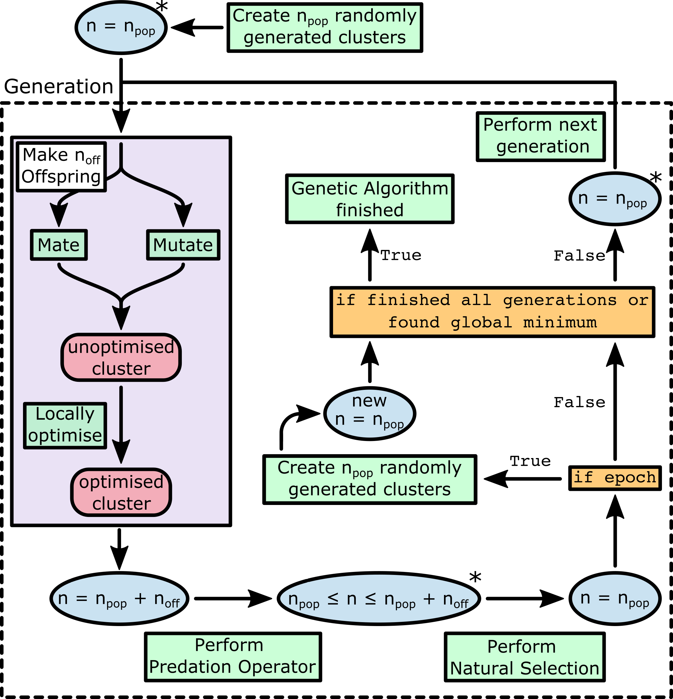

.. _How_Organisms_Works:

How the Otago Research Genetic Algorithm for Nanoclusters, Including Structural Methods and Similatity (Organisms) Program Works
================================================================================================================================

How the Genetic Algorithm Works
*******************************

The genetic algorithm is based on Darwin's Theory of Evolution. The algorithm implemented in this program will first create a population of randomly generated clusters. However, the population can be partially or fully populated with user-created clusters (more information given :ref:`Initialising a New Population <Initialising_a_New_Population>`). 

Individuals in the population are mated together and/or mutated to give a set of new offspring. These offspring can be removed if they are too similar to other offspring or clusters in the population if they are too similar to each other in some way. This is determined by a predation operator (more information is given in :ref:`Using Predation Operators <Using_Predation_Operators>`). The offspring are then added to the population. 

The clusters are also assigned a fitness based on a fitness operator (more information is given in :ref:`Using Fitness Operators <Using_Fitness_Operators>`). The fitness is used to determine how clusters will be used to pick parents and clusrters for the mating and mutation proceedures, in removing clusters during the predation proceedure, and during the natural selection proceedure (reference to :ref:`Using Fitness Operators <Using_Fitness_Operators>` for more information). 

Finally, a "Natural Selection" process will remove the least fit clusters from the population, while the fitter clusters will remain in the population. This process, from the creation of new offspring to the natural selection process is called a generation. 

This process is repeated until the desired number of generations are reached. 

   This is a general schematic of the genetic algorithm applied to clusters.

How the Genetic Algorithm Works in Organisms
*********************************************

This implementation of the genetic algorithm has been designed with a few ideas in mind

1. The algoritm has been designed to warn the user if there is any chance the inputs the user has inputted will break the genetic algoithm or give nonsense results. The algorithm will not begin and purposely exit without running if it thinks that there will be a problem that would cause the algorithm to break or not function as intended. **It is recommended that you run your genetic algorithm at least once for at least 2 generations to check it will run without any obvious issues arising**. 

2. This implementation has been designed as best as possible to allow for further modification of the algorithm to allow the user to play with the algorithm and add and motify functionalities of the algorithm as to research how to improve the efficiency of the genetic algorithm. This is especially the case for predation and fitness operators which were the focus of a PhD Thesis. 

3. This algorithm has been designed to include as many features as possible that have been mentioned or explained in the literature. 

4. This algorithm has been designed to be restartable. This features that allow this algorithm to be restartable are explained further in :ref:`Restarting the Genetic Algorithm <Restarting_the_Genetic_Algorithm>`. 

5. This algorithm is the first genetic algorithm that has been created for globally optimising clusters in the Garden group. For this reason and because the initial goal of Geoff's PhD was to improving the efficiency of the genetic algoithm, making sure the algorithm works as intended with minimal bugs was more important than the speed of the algorithm (in regards to real time speed and not efficiency of the algorithm), and making sure the algoithm was written well was priority. Attempts have been made to increase the speed and decrease the running time of the algorithm have been made, such as parallelising the algorithm, however it is likely that this algorithms speed can not be improved until the generation proceedure of this algorithm is written without algorithm checks and written in a faster language. The speed of the ASE based local optimisers may also be an issue, as these are also written in python. 

