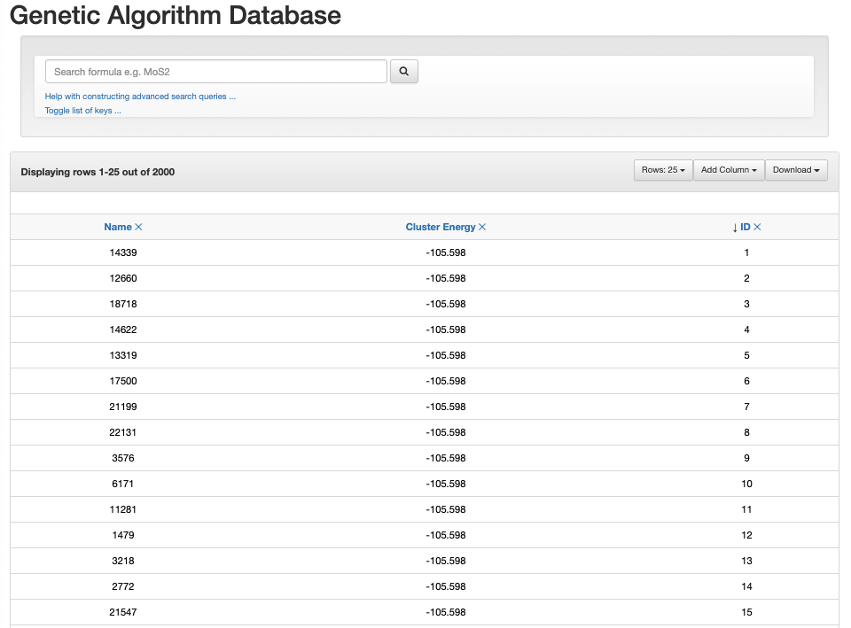
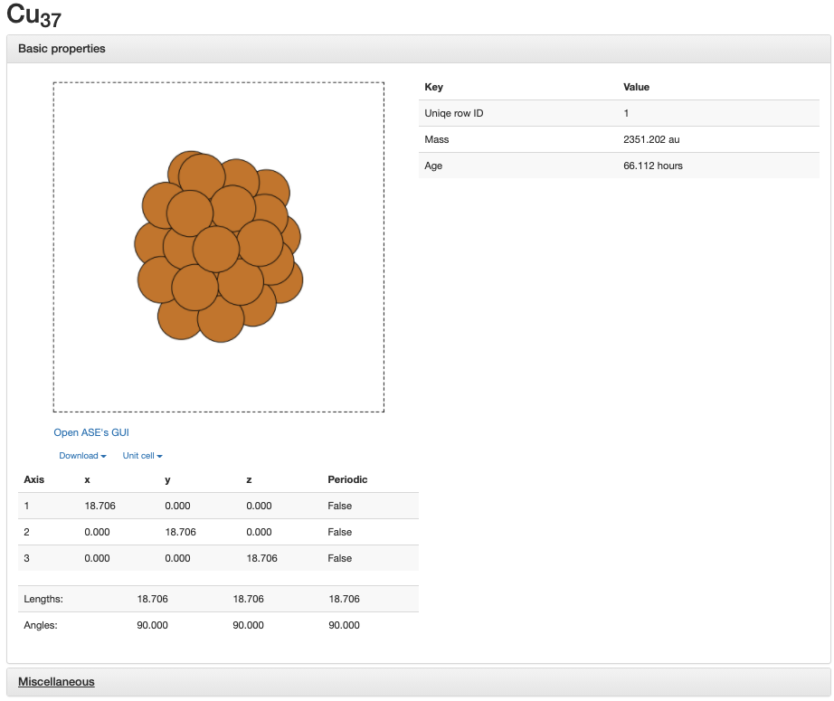

.. _Using_Databases_with_the_Genetic_Algorithm:

Using Databases with the Genetic Algorithm
==========================================

The genetic algorithm has been designed to create database files that are designed to hold data about the clusters that are created during the genetic algorithm. See `Databases in ASE <https://wiki.fysik.dtu.dk/ase/ase/db/db.html>`__ for information about how databases generally work in ASE. 

.. contents::
    :depth: 2
    :local:

Databases in Organisms
----------------------

There are a few databases that can be created during the genetic algorithm. First is the ``Population\Population.db`` database. This database is created to store clusters that are in the current population. This database is required by the genetic algorithm in case the user needs to resume the genetic algorithm. The user can also create the ``Recorded_Data/GA_Recording_Database.db`` database which is designed to save clusters that were created during the genetic algorithm. See :ref:`Recording Clusters From The Genetic Algorithm <Recording_Clusters_From_The_Genetic_Algorithm>` for more information on how to record clusters during the genetic algorithm. 

Opening ASE database website
----------------------------

ASE allows the user to view the database in a number of ways. See `ase db <https://wiki.fysik.dtu.dk/ase/ase/db/db.html#ase-db>`_ to see how to use this. One of these ways is using the database website viewer, which allows the user to view the clusters in the database in a very nice graphical user interface. To use this, write into the terminal ``ase db -w name_of_database.db`` and open up the website ``http://0.0.0.0:5000/``. 

In Organisms, metadata is saved to these databases that allows the information given in the ASE database website to be viewed easier. Due to a bug in ASE versions above ``3.20.0``, the metadata is not shown in ASE versions above ``3.20.0``. 

Opening ASE database website in ASE versions above and equal to ``3.20.0``
^^^^^^^^^^^^^^^^^^^^^^^^^^^^^^^^^^^^^^^^^^^^^^^^^^^^^^^^^^^^^^^^^^^^^^^^^^

We have created a program called ``database_viewer.py`` that allows the metadata to be included in all versions of ASE. This program is run by the user moving into the ``Recorded_Data`` folder in the terminal and running the ``database_viewer.py`` program. There is one parameter that need to be entered. This is:

* **name_of_database** (*str.*): This is the name of the database that you want to view.

Enter this into the terminal when you type in ``database_viewer.py``:

.. code-block:: bash

	database_viewer.py name_of_database

The bug is not that the metadata is not included in the database, but the ASE database website does not use that metadata to make the website easier to read.

Opening ASE database website in ASE versions below and equal to ``3.19.3``
^^^^^^^^^^^^^^^^^^^^^^^^^^^^^^^^^^^^^^^^^^^^^^^^^^^^^^^^^^^^^^^^^^^^^^^^^^

There is no bug in ASE database website viewer. You can open databases with these versions of ASE by typing into the terminal 

.. code-block:: bash

	ase db -w name_of_database.db

where ``name_of_database.db`` is the database you want to include. The metadata is included in this database.

How to use the ASE database website
^^^^^^^^^^^^^^^^^^^^^^^^^^^^^^^^^^^

When you use ``database_viewer.py`` or ``ase db -w`` to open a ASE database website, you will see the database can be organised by Name, Cluster Energy, and ID. By default, the database in ``Recorded_Data/GA_Recording_Database.db`` is ordered by cluster energy

You can click on these to change the ordering. You can also click on add columns to add other pieces of data recorded in the database to the website. The ``Toggle list of keys ...`` indicates what all the data means.  

If you click on one of the cluster, you can view all the information about that cluster and can view that cluster with a picture. You can also click on the **Miscellaneous** button to get more information about the cluster other than what is shown directly on the page.

If you click on **Open ASE's GUI**, you can get a interactive viewer for that cluster. You can also download the cluster as a `.xyz` file by clicking on **Download**. If you have ASE 3.20.0 or higher, you can also view this cluster on the website with jmol. 

Make a custom metadata file (*meta.py*)
---------------------------------------

You can also make a custom format for the ASE database website. To do this you will want to run the following command in the terminal ``ase db -w name_of_database.d -M meta.py``. The ``meta.py`` file is a python file that can be used to custom format the ASE database website. The ``meta.py`` file is designed to give the database title, give definitions for all the variables given to the database, and the format of the database website. The ``meta.py`` file contains the following variables:

* **title** (*str.*): This is the title of the database
* **default_columns** (*dict.*): This contains information about each variable in the database
* **key_descriptions** (*list of str.*): This is a list that specifies the order variable given in the database.

An example is a meta.py file is given in ``Helpful_Programs`` and an example is also given below

.. literalinclude:: meta.py
	:language: python
	:caption: meta.py
	:name: meta.py
	:tab-width: 4
	:linenos:

The format for the database as specified in this example is: ``name    cluster_energy    id``. 

The following variables are included in the database:

* **name** (*int*): Name of the cluster.
* **gen_made** (*int*): The generation the cluster was created.
* **cluster_energy** (energy units, *float*): Potential energy of the cluster.
* **ever_in_population** (*bool*): This variable indicates if the cluster was ever in the population. If an offspring was made and was not ever accepted into the population, this variable will be False. If the cluster had been in the population for even one generation, this variable will be True.
* **excluded_because_violates_predation_operator** (*bool*): This variable will determine if a cluster was excluded from the population because it violated the predation operator.
* **initial_population** (*bool*): This variable will indicate if the cluster was apart of a newly created population.
* **removed_by_memory_operator** (*bool*): This variable will indicate if a cluster is removed because it resembles a cluster in the memory operator.
