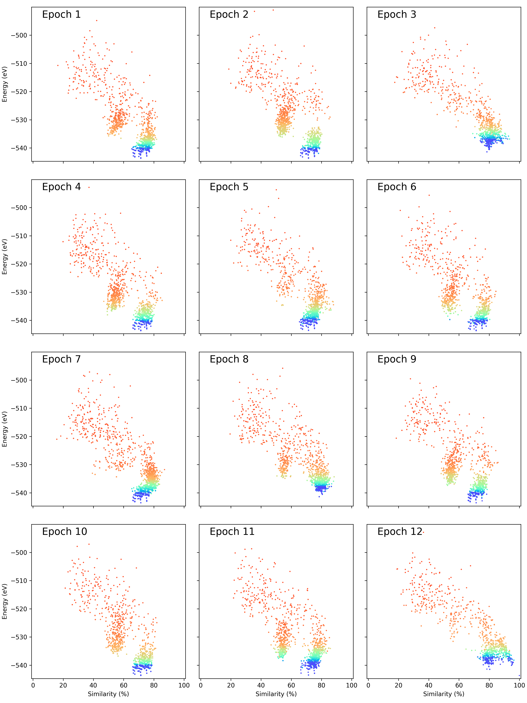
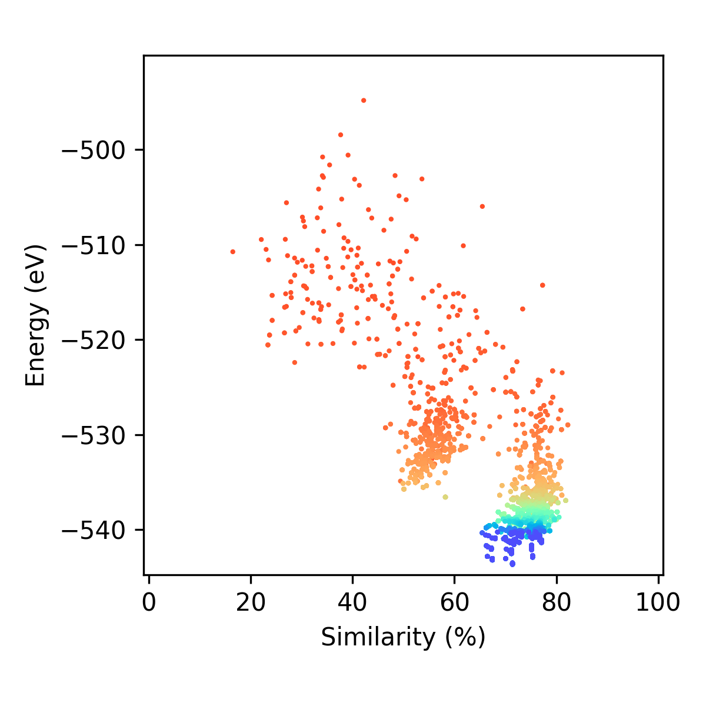

.. _make_energy_vs_similarity_results_documentation:

Information about using the *make_energy_vs_similarity_results.py* script
#########################################################################

This page gives a description how to analysed the clusters that have been created. This page is an extention of :ref:`make_energy_vs_similarity_results.py - For analysing the genetic algorithm under-the-hood<make_energy_vs_similarity_results>` 

One of the bits of information that you may like to obtain from the genetic algorithm, especially if you are accessing the efficiency of the genetic algorithm program, is what happened when various genetic algorithms ran. One way of assessing what happened during a genetic algorithm is to observe what clusters were created as the genetic algorithm ran. This is practically very hard to do if you are just looking at the clusters that are made. However, if you can assess the clusters that you make with various parameters, you can get a better idea of the type of clusters that were created during your genetic algorithm. 

The best way to monitor the types of clusters that are created is using a potential energy surface (PES) plot, which describes the energy as a function of the spatial positions of the atoms in your cluster. This type of plot can not be visualise as this would require a plot with :math:`3N-6` spatial axes and one energy axis (where :math:`N` is the number of atoms in your cluster). Instead, we (and others in the literature) have found it best to replace the :math:`3N-6` spatial axes with one or two axis that describe the structural similarity between clusters. 

In Organisms, we have a function that is able to describe the structural similarity between various clusters based on the common neighbour analysis. This function is called the Structural Comparison Method (SCM). Using this similarity parameter, it is possible to plot a PES plot, where: 

* the x axis is the similarity between clusters made during your genetic algorithm against a reference cluster, and 
* the y axis is the energy of the cluster.

We have created the *make_energy_vs_similarity_results.py* program that processes the data from your genetic algorithm and gives you energy vs. similarity plots that describes the types of cluster that were created during the genetic algorithm and plots them in the style of a PES plot. In this page, we will describe how to use this program, as well as describe the types of plots that you will obtain from this program. 

Requirements for using the *make_energy_vs_similarity_results.py* Program
*************************************************************************

To use this program, you must record all the clusters that were created during the genetic algorithm. This requires your ``ga_recording_information`` dictionary to be set to record all clusters created during the genetic algorithm. Do to this, include the following in the ``ga_recording_information`` variable in your ``Run.py`` file:

.. code-block:: Python

	ga_recording_information = {}
	ga_recording_information['ga_recording_scheme'] = 'All'
	ga_recording_information['exclude_recording_cluster_screened_by_diversity_scheme'] = False

Note that you can still set the ``saving_points_of_GA``, ``record_initial_population``, and ``show_GA_Recording_Database_check_percentage`` variables how ever you like. 

Running the *make_energy_vs_similarity_results.py* Program
**********************************************************

Due to the complexity of the information required to run this program, this program is executed from a python script rather than accessing it directly unlike most of the other side programs available in Organisms. 

An example of the ``Run_energy_vs_similarity_script.py`` script that is used to execute the *make_energy_vs_similarity_results.py* program for a global optimisation of a 98-atom Lennard-Jones cluster is given below:

.. literalinclude:: Run_energy_vs_similarity_script.py
	:language: python
	:caption: Run_energy_vs_similarity_script.py
	:name: Run_energy_vs_similarity_script.py
	:tab-width: 4
	:linenos:

Lets go through each part of the ``Run_energy_vs_similarity_script.py`` file one by one to understand how to use it. 

1) Variables for processing data
================================

There are three variables required that determine how data from the genetic algorithm will be processed for making energy vs similarity plots. These are:

* **path_to_ga_trial** (*str.*): This is the path to the genetic algorithm data that you want to process. This will have the same path as your ``Run.py`` file. 
* **rCut** (*float*): This is the rCut value for the common neighbour analysis in Angstroms. This value determines which pairs of atoms are within bonding distance: 
	- If a pair of atoms have an interatomic distance less than or equal to rCut, that pair of atoms is considered neighbours/bonded. 
	- If a pair of atoms have an interatomic distance greater than rCut, that pair of atoms is not considered neighbours/bonded. 
* **clusters_to_compare_against** (*ase.Atoms or [list of ase.Atoms]*): These are all the clusters that you want to compare clusters to. Generally, you will only want to compared to genetic algorithm clusters to one reference cluster, such as the global minimum. However, if you need to do some checks, you can compare your genetic algorithm clusters to a few reference clusters. If you only want to give one reference cluster, assign **clusters_to_compare_against** to the ``ase.Atoms`` object for your cluster. If you have several reference clusters, put their ``ase.Atoms`` objects into a list. You can import most types of files as ``ase.Atoms`` object using the ase.io.read function. See `File input and output <https://wiki.fysik.dtu.dk/ase/ase/io/io.html?highlight=read#ase.io.read>`_ to read more about the read function in ASE. 
* **calculator** (*ase calculator*): If you want to locally minimise the cluster you gave for **clusters_to_compare_against** before this algorithms begins, set the calculator to the calculator you used in your genetic algorithm. This will not locally minimise any of the clusters that you created during the genetic algorithm, it will only be used to locally minimise **clusters_to_compare_against**. If you set the calculator to ``None``, **clusters_to_compare_against** will not be locally optimised and will be used as is in this program. Default: ``None``
* **no_of_cpus** (*int*): This is the number of cpus that are used to gather information that is used for making these energy vs similarity plots. Default: ``1``

An example of these parameters in Run.py is given below:

.. literalinclude:: Run_energy_vs_similarity_script.py
	:language: python
	:tab-width: 4
	:linenos:
	:lineno-start: 5
	:lines: 5-21

2) Variables for plotting data
==============================

There are several variables required that determine how data from the genetic algorithm will be processed for making energy vs similarity plots. These are placed in the ``plotting_settings`` dictionary. These avariables are:

* **make_epoch_plots** (*bool*): This plots the genetic algorithm over generations, as well as making plots over generations that are divided into era between epoches. Default = ``False``. 
* **get_animations** (*bool*): This will make a movie file of your energy vs similarity plots as they were made over generations if you set this to ``True``. The offspring are included in this video. If you dont want these videos, set this to ``False``. Default = ``False``. 
* **get_animations_do_not_include_offspring** (*bool*): This will make a movie file of your energy vs similarity plots as they were made over generations if you set this to ``True``. The offspring are not included in this video. If you dont want these videos, set this to ``False``. Default = ``False``. 
* **make_svg_files**  (*bool*): If this is set to ``True``, this program will make svg files of plots that are created. These svg files allow the plots to be customised using programs like inkscape. If this is set to ``False``, svg files of plots will not be created. Note that png files of plots are always created by this progrom no matter what you choose this setting to be. Default = ``False``. 

You can also set the animation variables in the ``plotting_settings`` dictionary. You only need to set either **gps** or **max_time** in this dictionary. 

* **gps** (*int*): This is the number of generations that are filmed per second. This is equivalent to the frame per second or the rate rate of the animation. Default = ``1``. 
* **max_time** (*float*): This is the maximum amount of time that your animations will run for. Default = ``None``. 
* **label_generation_no** (*bool*): If ``label_generation_no`` is set to ``True``, the number of generations that have past will be shown. Default = ``False``.  
* **label_no_of_epochs** (*bool*): If ``label_no_of_epochs`` is set to ``True``, the era value and the number of epoches that have occur will be labelled in your animation. Default = ``False``.  
* **energy_units** (*str.*): This variable allows you to give a custom unit for the energy the energy of your clusters are recorded in a units that is not eV. For example, if you are perfomring these plots on Lennard-Jones clusters, you may want to set this value to ``'LJ energy units'``. Default: ``'eV'`` 

**IMPORTANT NOTE**: In you give a value for ``max_time`` that is not ``None``, this program will make sure that your movies only run for at most this amount of time. If you do not give a value for ``max_time``, it will be set to ``None`` by default, which will tell the program to take your value of ``gps`` for the equivalent of the frames per second that the movie will run at. 

An example of these parameters in Run.py is given below:

.. literalinclude:: Run_energy_vs_similarity_script.py
	:language: python
	:tab-width: 4
	:linenos:
	:lineno-start: 23
	:lines: 23-47

3) Running the *make_energy_vs_similarity_results.py* program
=============================================================

You have got to the end of all the parameter setting stuff. Now you can run the ``make_energy_vs_similarity_results.py`` program.

.. literalinclude:: Run_energy_vs_similarity_script.py
	:language: python
	:tab-width: 4
	:linenos:
	:lineno-start: 49
	:lines: 49-52

Data files that are made during this program
********************************************

Within the ``Similarity_Investigation_Data`` folder that is created by this program are three txt files. There are:

* ``energy_and_GA_data.txt``: This contains all the information about the clusters created during the genetic algorithm, including the generation when the cluster was created. 
* ``CNA_Profile_data.txt``: This contains all the total CNA profiles for each cluster created during the genetic algorithm as measured with the ``rCut`` value you gave
* ``similarity_data_cluster_NNN.txt``: This contains all the similarity data for each cluster as compared to the cluster you gave in ``clusters_to_compare_against``. There are a number of files given for each cluster that you are comparing in this program. ``NNN`` is the number given to each of your inputted reference clusters. This number is given in the order that you placed clusters in the ``clusters_to_compare_against`` list. If you only gave an ``ase.Atoms`` object, ``NNN`` will just be given as 1. 

It is possible to restart this program if it fails midway through, or if you want to change one of the setting of your plots. These files are needed if you want to restart your program. **Do not delete these files if you want to restart this program**.

What plots do you get from the *make_energy_vs_similarity_results.py* program?
******************************************************************************

As well as the data files described above, this program also gives plots and movie files of your genetic algorithm in a folder inside the ``Similarity_Investigation_Data`` folder called ``Ref_Cluster_NNN``, where ``NNN`` is the number given to each of your inputted reference clusters. This number is given in the order that you placed clusters in the ``clusters_to_compare_against`` list. If you only gave an ``ase.Atoms`` object, ``NNN`` will just be given as 1. 

In this folder you will find the following plots and movies (depending on the settings you gave in the ``plotting_settings`` dictionary). There are (with examples for locally optimising a LJ98 cluster using the energy predation operator, energy fitness operator, and the population epoch operator where nepoch = 1): 

if ``make_epoch_plots = True``:
===============================

You will get two types of plots that contain each individual era (between epochs) and a collection of eras together on the same place.

if ``get_animations = True``:
=============================

This will create a video file that shows how the clusters changed over time in the population, including the offspring that are created in orange. 

.. raw:: html
    

        <iframe src="https://www.youtube.com/embed/fAVbxiNVcNs" frameborder="0" allowfullscreen style="position: absolute; top: 0; left: 0; width: 100%; height: 100%;"></iframe>
    

if ``get_animations_do_not_include_offspring = True``:
======================================================

This will create a video file that shows how the clusters changed over time in the population. This video only shows the change in the population over time without including offspring created in the video. 

.. raw:: html
    

        <iframe src="https://www.youtube.com/embed/SXhnnvDRIso" frameborder="0" allowfullscreen style="position: absolute; top: 0; left: 0; width: 100%; height: 100%;"></iframe>
    

Troubleshooting possible issues that can arise
**********************************************

Here are some of the troubleshooting issue that have occurred in the past and possible troubleshooting solution to problem:

While ANALYSE CLUSTERS AND CNA PROFILES, each cluster are taking a very long time to process
============================================================================================

I have found that sometimes the **Cluster Analysed:** does not show up while the program is running for some reason. However, something to check is what is being written to **energy_and_GA_data.txt** and **CNA_Profile_data.txt** in your **Similarity_Investigation_Data** folder and keep opening it up multiple time to see if new clusters are being written to these files. 

If it is taking a while for a cluster to be written, take a look at the CNA profile that are being written to **CNA_Profile_data.txt**. The CNA profiles should contains many entries of signatures, like for example:

``{'CNA_profile': [Counter({(4, 3, 3): 78, (4, 2, 2): 66, (5, 5, 5): 61, (3, 2, 2): 49, (2, 1, 1): 42, (5, 4, 4): 39, (3, 1, 1): 36, (2, 0, 0): 27, (4, 2, 1): 22, (3, 0, 0): 4, (1, 0, 0): 3, (4, 1, 1): 3})], 'name': 1}``

If you have entries that look more like this

``{'CNA_profile': [Counter({(113, 225, 208): 4753})], 'name': 1}``

This is a sign that you have set your ``rCut`` value way to high, or somewhere in your ``Run_energy_vs_similarity_script.py`` script you have accidentally changed your ``rCut`` value to a very high value. Make sure that you set ``rCut`` to a value somewhere in between the first and second nearest neighbour values (ideally to half way between these values). 
